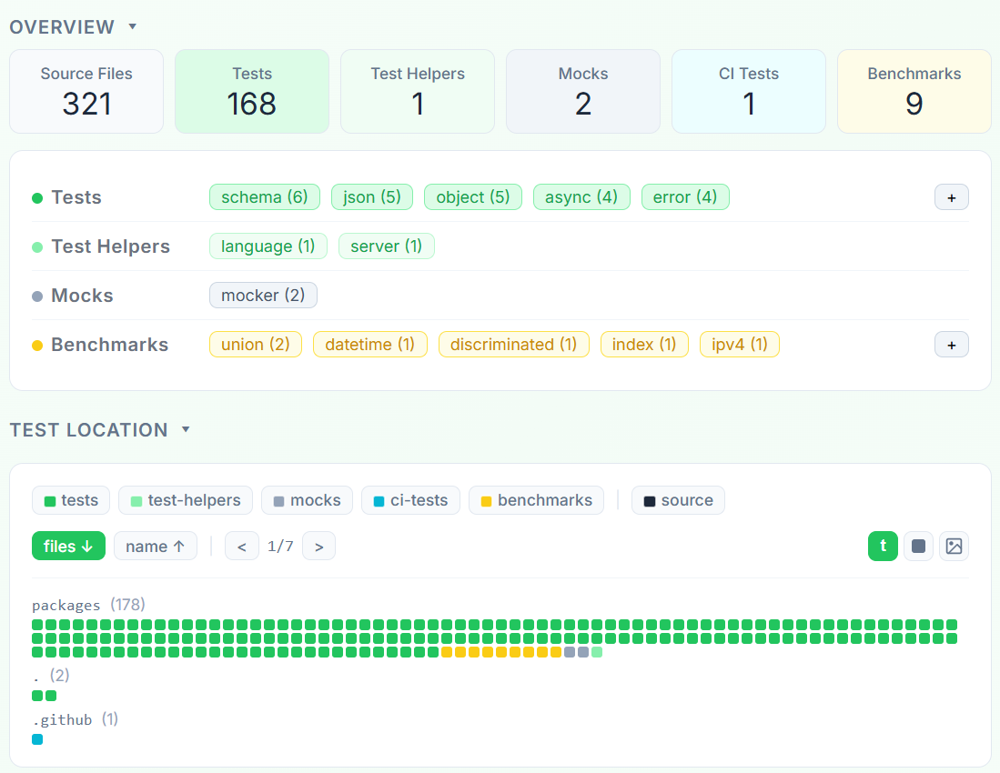

# Explorando Práticas de Teste

Neste exercício, vamos explorar práticas de teste em sistemas reais utilizando a ferramenta [TestMiner](https://andrehora.github.io/testminer).

O TestMiner permite visualizar e analisar testes de software em repositórios do GitHub, fornecendo dados sobre como os projetos organizam seus testes, como eles evoluem entre versões e quais bibliotecas de teste são utilizadas.
Explore a ferramenta antes de começar para se familiarizar com seu funcionamento.

---

## Passo 1: Selecionar um repositório

Escolha um repositório real que possua testes escritos na linguagem de sua preferência.
Abaixo estão alguns links para ajudá-lo a encontrar projetos interessantes:

- **Python:** https://github.com/topics/python?l=python
- **JavaScript:** https://github.com/topics/javascript?l=javascript
- **TypeScript:** https://github.com/topics/typescript?l=typescript
- **Java:** https://github.com/topics/java?l=java

## Passo 2: Explorar o repositório selecionado

Busque o repositório escolhido no [TestMiner](https://andrehora.github.io/testminer) e analise os dados de teste gerados pela ferramenta.

## Passo 3: Explicar uma prática de teste

Com base nos dados obtidos, selecione uma prática ou dado de teste relevante e explique-o com suas próprias palavras.

---

## Instruções de entrega

1. Faça um `fork` deste repositório (saiba mais sobre forks [aqui](https://docs.github.com/pt/pull-requests/collaborating-with-pull-requests/working-with-forks/fork-a-repo)).
2. Responda às questões abaixo diretamente neste arquivo `README.md` do seu fork. Pode adicionar imagens para enriquecer sua explicação.
3. No Moodle, submeta apenas a URL do seu fork.

---

## Respostas

**1. Repositório selecionado:** https://github.com/colinhacks/zod

**2. Explicação:** 
Zod é uma biblioteca que permite validar dados e definir schemas em TypeScript, garantindo que os dados estejam no formato esperado. 

Ao analisar o overview dado pelo TestMiner, um ponto que chamou atenção foi a proporção entre a quantidade de testes (168) e a quantidade de arquivos de código-fonte (321), o que pode ser um indicativo de que a biblioteca é madura e confiável. Essa percepção está relacionada a cobertura de testes que apesar de não ser um indicador absoluto de qualidade, se mostra relevante por abranger diferentes classes como async, object, schema e helpers, além de incluir até testes para mocks (na imagem abaixo é possível ver um “teste de CI”, mas isso foi um falso positivo devido ao nome do arquivo test.yml que é só mais uma configuração do CI).

Ao conferir alguns testes, é possível observar a presença tanto de testes unitários quanto de integração. Pela natureza do que a lib se propõe, não faz muito sentido aplicar testes end-to-end, já que ela não representa uma aplicação completa com fluxo de usuário. Assim, foi possível concluir que o foco dado está nos testes que são mais adequados para validar o comportamento de funções e a composição de schemas, ou seja, nos unitários e de integração. 

